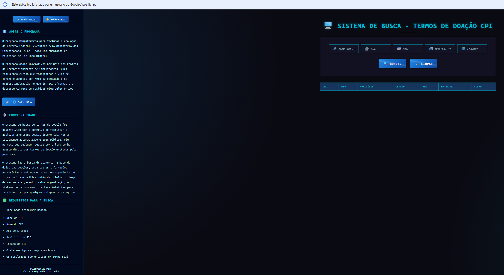
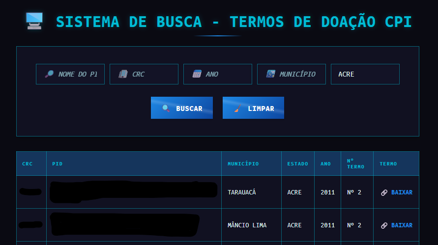

# Busca Rápida de Documentos - Google Apps Script


## Sobre o Projeto

Sistema desenvolvido utilizando Google Apps Script para automatizar a localização de documentos armazenados no Google Drive. A ferramenta permite realizar buscas rápidas por termos relacionados às entregas do Programa Computadores para Inclusão, facilitando consultas administrativas, auditorias e processos de comprovação documental.

A solução elimina a necessidade de buscas manuais em múltiplas pastas, reduzindo significativamente o tempo gasto na localização de arquivos e aumentando a eficiência na gestão documental.

---

## Screenshots

### Tela principal do sistema



### Exemplo de pesquisa de documentos



---

## Funcionalidades

* Busca automatizada de documentos no Google Drive
* Pesquisa por nome do ponto de inclusão digital
* Pesquisa por estado, município ou centro doador
* Filtro por ano de entrega
* Localização rápida de termos de doação em PDF
* Centralização das informações documentais
* Redução de tempo em consultas e auditorias

---

## Tecnologias Utilizadas

| Tecnologia         | Descrição                                      |
| ------------------ | ---------------------------------------------- |
| Google Apps Script | Automação das buscas e integração dos serviços |
| Google Drive       | Armazenamento dos documentos                   |
| Google Sheets      | Interface e base de consulta                   |

---

## Estrutura do Projeto

* busca-rapida-documentos/
* |
* |--- src/ # Código Apps Script de exemplo
* |--- docs/ # Prints de demonstração
* |--- resultados/ # PDFs de exemplo e materiais de design
* |--- README.md

---

## Como Executar

1. Clone o repositório:

   ```bash
   git clone https://github.com/ProfissionalJV/document-search.git
   ```

2. Configure o Google Apps Script vinculado à planilha

3. Defina os diretórios do Google Drive que serão indexados

4. Execute a aplicação e realize as pesquisas desejadas

---

## Observação

As estruturas reais e originais possuem informações privadas e de uso interno. Os códigos, documentos e exemplos apresentados foram adaptados exclusivamente para fins de demonstração, documentação e composição de portfólio.

---

## Autor

**Victor Arsego Lêla**

* Desenvolvedor Web e Automatizador de Processos
* Engenharia da Computação - CEUB
* Gestão Pública - Estácio
* [LinkedIn](https://www.linkedin.com/in/vltech/)
